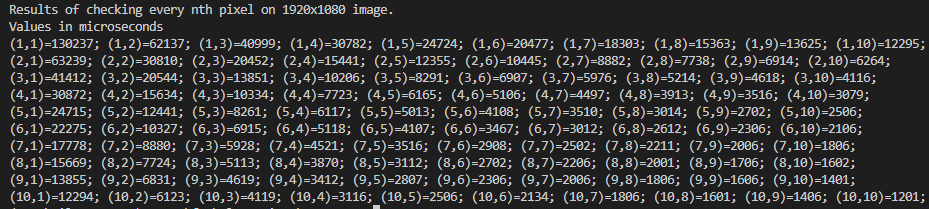

Results:

From the test, parsing image fully takes 0.1 seconds, while reducing pixels scanned on each axis by 4 (effectively by 16) also divides that time by 16.

Therefore for now we'll use division by 4.